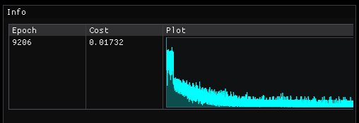

# Machine Learning

A small personal experiment for learning how neural networks work — feedforward passes and
backpropagation written from scratch in C++, with no ML frameworks behind them. It's not meant to be a
reusable library; the `Machine Learning` project is just a minimal neural-network core that backs two
example apps: learning a logic gate and recognizing hand-drawn digits.

## Preview

**Digit recognition**


**Training** — cost decreasing over time while the digit network learns



## Features

- Fully-connected feedforward networks with arbitrary architectures
- Backpropagation with mini-batch **Stochastic Gradient Descent**
- Multiple activation functions: **Sigmoid**, **ReLU**, **Tanh**
- Random weight/bias initialization
- Saving and loading trained models to a plain-text `.nn` file
- A tiny built-in `Matrix` type — no external math dependencies in the core

## Project structure

| Project | Type | Description |
| --- | --- | --- |
| `Machine Learning` | Static library | The neural network and matrix code (`NeuralNetwork`, `Matrix`, `NNUtils`) that the examples build on. |
| `Example_XOR` | Console app | Trains a tiny network on a logic gate and prints the result. |
| `Example_DigitRecognition` | GUI app | Draw a digit and have the network classify it; can also train from the bundled data. Uses GLFW + glad + Dear ImGui/ImPlot for the interface. |

## Setup

Built with **Visual Studio 2022**. Open `Machine Learning.sln`, pick a startup project (`Example_XOR` or
`Example_DigitRecognition`), and build/run. The examples link against the `Machine Learning` static
library; the digit-recognition example's third-party libraries are vendored in its `dependencies/` folder,
so there's nothing to install.

## How it works

Setting up and training a network looks like this (taken from the XOR example):

```cpp
#include <NeuralNetwork.h>

// 2 inputs, 1 output, sigmoid activations.
NeuralNetwork nn({ 2, 1 }, NNActivationFunction::Sigmoid);
nn.RandomizeLayers(-2.0f, 2.0f);
nn.SetTrainingData(inputs, outputs);   // std::vector<std::vector<float>>

for (size_t i = 0; i < 25000; i++)
{
    nn.Train_Backpropagation();        // accumulate gradients
    nn.Learn(0.1f);                    // apply them (learning rate 0.1)
}

std::vector<float> result = nn.Feedforward({ 0, 1 });
```

Each training step computes gradients via backpropagation and takes one gradient-descent update.
With `SetStochastic(batchSize)` a step draws a fresh **random mini-batch** rather than passing over the
whole dataset - so a "step" here **is not** a full epoch over the training data.

## Examples

### XOR

`Example_XOR` trains a small network on a logic gate from four samples and prints the cost and a
prediction. It's the quickest way to confirm the core builds and learns.

### Digit recognition

`Example_DigitRecognition` opens a 28x28 drawing board. Draw a digit, press **Validate**, and the network
outputs its prediction. The `mnist/` folder holds the training images (`.pbm` format) and a pre-trained
model (`data.nn`).

- **Run mode** (default) loads `mnist/data.nn` and classifies what you draw.
- **Training mode** retrains from the images in `mnist/`. Set `TRAINING_BUILD` to `1` in
  `Example_DigitRecognition/src/Config.h` and rebuild; learning rate, batch size, and step count are
  configurable in the same file.

The bundled dataset is small (~1000 images), so the classifier is sensitive (and probably overfits) to how you draw but works most
of the time.

## Resources

- 3Blue1Brown — Neural Networks: https://www.3blue1brown.com/topics/neural-networks
- YouTube series: https://www.youtube.com/playlist?list=PLpM-Dvs8t0VZPZKggcql-MmjaBdZKeDMw
- Similar problem walkthrough: https://www.youtube.com/watch?v=hfMk-kjRv4c
